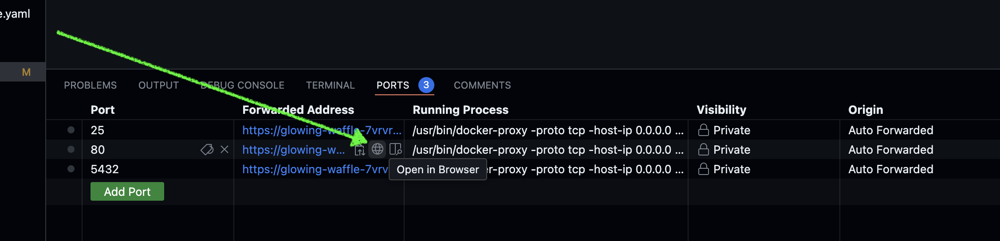
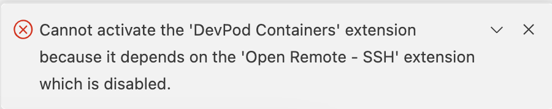

# idfm_hackaton_2024

# Prez

2 APIs
- ml-model
- reading-conversations

2 fichiers de secrets.env
PRIM, OPENAI_API_KEY


## To Setup frontend
cd frontend-angular 

curl -o- https://raw.githubusercontent.com/nvm-sh/nvm/v0.40.1/install.sh | bash

export NVM_DIR="$HOME/.nvm"
[ -s "$NVM_DIR/nvm.sh" ] && \. "$NVM_DIR/nvm.sh"  # This loads nvm
[ -s "$NVM_DIR/bash_completion" ] && \. "$NVM_DIR/bash_completion"  # This loads nvm bash_completion

nvm install 20

npm install

npm install -g @angular/cli@17

npm run start

## To run APIs
cd backend/api-ml-model
poetry install
poetry run fastapi run main.py


## To Setup this project in Onyxia's VSCode
- Run:
```sh
git clone https://github.com/talan-tech-for-data/idfm_hackaton_2024.git .

sh -c "$(curl --location https://taskfile.dev/install.sh)" -- -d -b ~/.local/bin

sudo apt-get update -y
sudo apt-get install -y pipx

pipx install poetry

poetry config virtualenvs.in-project true

poetry install

cd frontend

curl -o- https://raw.githubusercontent.com/nvm-sh/nvm/v0.40.1/install.sh | bash

export NVM_DIR="$HOME/.nvm"
[ -s "$NVM_DIR/nvm.sh" ] && \. "$NVM_DIR/nvm.sh"  # This loads nvm
[ -s "$NVM_DIR/bash_completion" ] && \. "$NVM_DIR/bash_completion"  # This loads nvm bash_completion

nvm install 20

npm install

#npm run dev -- --host 0.0.0.0

cd ..
cd hackathon_ia_mobilites_2024
git submodule update --init

#git submodule add https://github.com/IleDeFranceMobilites/hackathon_ia_mobilites_2024/
#git submodule update --init --remote # to pull from the hackaton repo


```

## To Install Sveltekit in Local Devcontainer or Github's devcontainer
### To start work, from zero:
- Run:

```bash

cd frontend

# install nvm
curl -o- https://raw.githubusercontent.com/nvm-sh/nvm/v0.40.1/install.sh | bash

# activate nvm in current shell
export NVM_DIR="$HOME/.nvm"
[ -s "$NVM_DIR/nvm.sh" ] && \. "$NVM_DIR/nvm.sh"  # This loads nvm
[ -s "$NVM_DIR/bash_completion" ] && \. "$NVM_DIR/bash_completion"  # This loads nvm bash_completion

# install node 20
nvm install 20
# install project
npm install

npm run dev -- --open


```

### To Start dev in sveltekit:
```bash

cd frontend
# start the server and open the app in a new browser tab
npm run dev -- --open
```

### Other notes on sveltekit
```bash
nvm use 20
npm run build
```

```bash
npm run preview -- --open
```


## Other Notes
### When creating your vs code in onyxia, forward port 5173 for sveltekit


### To Install Windmill in Local devcontainer
Make sure Docker is started:

Mac: open /Applications/Docker.app
Windows: start docker
Linux: sudo systemctl start docker
and type the following commands:

```sh
cd windmill

# To start from scratch
#curl https://raw.githubusercontent.com/windmill-labs/windmill/main/docker-compose.yml -o docker-compose.yml
#curl https://raw.githubusercontent.com/windmill-labs/windmill/main/Caddyfile -o Caddyfile
#curl https://raw.githubusercontent.com/windmill-labs/windmill/main/.env -o .env

#docker compose up -d
docker compose -f windmill-docker-compose.yml up -d
```

Go to http://localhost on port 80
- _(Or equivalent in github devcontainer)_


Then you can login for the first time.

### opeenwebui
https://openwebui.com/assets/files/whitepaper.pdf

### port forwarding for sveltekit in local devcontainer
https://code.visualstudio.com/docs/devcontainers/containers#_always-forwarding-a-port


### In onyxia, Dev container extension won't work, because their current vscode implementation has Open Remote SSH off


### ALTERNATIVE? starting from vanilla sveltekit

npx sv create app
cd app
npm install
npm run dev


# Other


poetry run python dump.py frontend-angular/src/app app.txt

—Front—
P0: Avec la voice, on peuple la BDD

P1: Itineraire
Est-ce qu'on requeter une API à eux

P2: CSS


—Back-

Back Saou:
P0 => 


Back Andrés:
P0 => local, et tu push le code


API : Demande itineraitres
routeAPI : options_and_metadata
P0: 'Nettoyage'


durations
distances
fare
air_pollutants
co2_emissions

tags
equipments
additional_information

disruptions


OUTPUT: 
intineraire donné:
BDD_choix
    option1
        hdhdh [features]
    option2
        metadta [features]
    option3 
        metadta [features]
    


P1 :
API : Demande itineraitres
routeAPI : optimized_answer (????)

Model abse sur une dataset:

Prez PPT
[BDD_choix + BDD_Appli  === Label ?]


